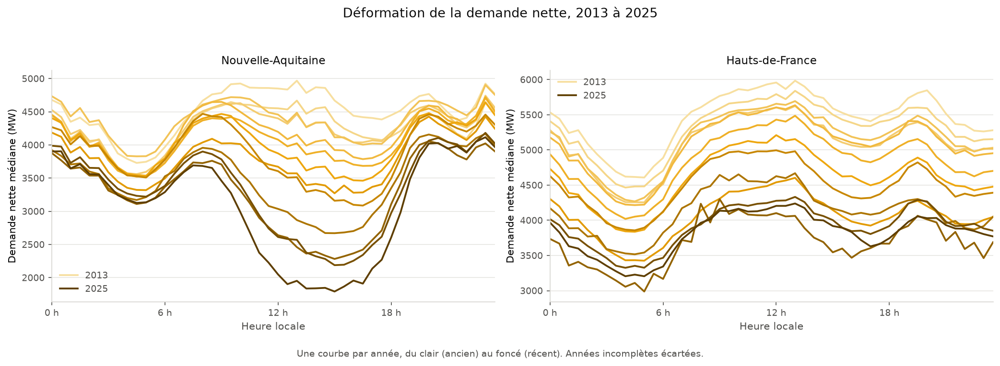
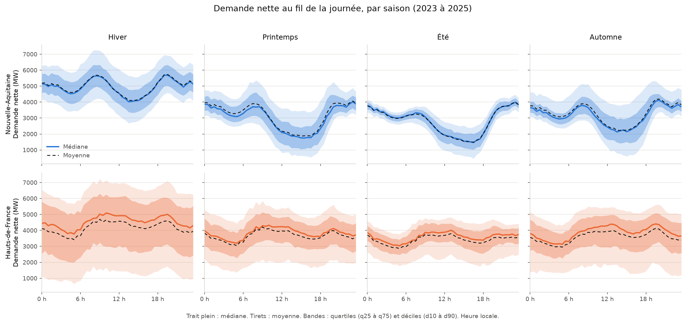

# ☀️⚡ Intégration du solaire dans le réseau électrique français

Analyse de l'intégration de la production solaire (et éolienne) dans le réseau
électrique français, à partir des données **officielles** de RTE / Enedis.

L'essor du photovoltaïque bouleverse l'équilibre du réseau : la production
solaire est intermittente et concentrée en milieu de journée. Elle creuse la
**demande nette** (la consommation moins la production renouvelable) au milieu du
jour, puis la laisse remonter brutalement le soir. Ce projet analyse cette
dynamique à l'échelle du système électrique français : comment la demande nette
se déforme-t-elle au fil de la journée et des saisons, comment ce creux évolue-t-il
à mesure que le parc solaire grandit, et comment le système s'adapte-t-il à cette
intermittence ?

## 📡 Données

- **Source** : [Open Data Réseaux Énergies (ODRE)](https://opendata.reseaux-energies.fr), plateforme officielle de RTE, Enedis et GRDF.
- **Jeu de données** : `eco2mix-regional-cons-def` (éCO2mix régional, consolidé définitif).
- **Contenu** : consommation + production par filière (solaire, éolien, nucléaire,
  hydraulique, thermique, bioénergies), pompage-turbinage et échanges physiques
  (imports/exports), au **pas de 30 minutes**, pour les **12 régions métropolitaines**.
- **Période** : depuis fin 2012, mise à jour en continu (~2,8 millions de lignes).
- **Licence** : [Licence Ouverte / Etalab](https://www.etalab.gouv.fr/licence-ouverte-open-licence).

> Les données ne sont **pas versionnées** dans ce dépôt (voir `.gitignore`).
> Elles se régénèrent en une commande via le script de téléchargement.

## 🚀 Reproduction

Prérequis : [uv](https://docs.astral.sh/uv/).

```bash
# 1. Installer l'environnement (Python + dépendances, versions verrouillées)
uv sync

# 2. Télécharger les données depuis l'API ODRE (~86 Mo, écrit dans data/)
uv run python src/download.py

# 3. Ouvrir le tableau de bord interactif
uv run streamlit run app/tableau_bord.py
```

Les scripts d'analyse de `notebooks/` sont découpés en cellules `# %%` et
s'exécutent pas à pas dans un éditeur comme Spyder.

> Après avoir modifié un fichier de `src/`, **arrêter et relancer** le tableau de
> bord : Streamlit recharge la page mais pas toujours les modules qu'elle importe.

## 🗂️ Structure

```
integration-solaire-reseau-france/
├── data/                 # données téléchargées (non versionnées)
├── src/
│   ├── download.py       # récupération des données via l'API ODRE
│   ├── preparation.py    # chargement et nettoyage (source unique)
│   ├── analyses.py       # calculs, renvoient des tableaux
│   └── graphiques.py     # figures Plotly
├── app/
│   └── tableau_bord.py   # tableau de bord Streamlit (mise en page seule)
├── notebooks/
│   ├── 01_exploration.py         # contrôle qualité des données
│   ├── 02_profils_saisonniers.py # sous-question 1 : profils par saison
│   └── 03_brouillon_visuel.py    # brouillon d'exploration visuelle
├── figures/              # figures produites par les scripts
├── docs/
│   ├── dictionnaire_donnees.md   # référence des variables
│   └── journal-projet.md         # décisions et constats, ordre antéchronologique
├── AGENTS.md             # document de référence pour les assistants
├── pyproject.toml        # dépendances (gérées par uv)
├── uv.lock               # versions verrouillées (reproductibilité)
└── README.md
```

Le nettoyage est défini **une seule fois**, dans `src/preparation.py`. Tout script
d'analyse appelle `charger_donnees()` plutôt que de refaire ses propres corrections.

## 🎯 Problématique

> **Comment la montée du solaire transforme-t-elle la demande nette d'électricité
> en France, et comment le système s'adapte-t-il à son intermittence ?**

Le projet est mené en deux phases.

**Phase 1 : dynamique temporelle** (échelle du système : 12 régions, pas de 30 min)
1. **Dynamique journalière** : la demande nette (`consommation − solaire − éolien`),
   son creux de mi-journée et sa remontée du soir, et sa déformation selon la saison.
2. **Évolution pluriannuelle** : ce creux se creuse-t-il à mesure que le parc solaire
   grandit (2013 → 2026) ?
3. **Équilibrage** : comment le système fait-il de la place au solaire montant
   (matin/midi), puis compense-t-il sa chute (soir) : pompage-turbinage, échanges
   (imports/exports) et filières flexibles.

**Phase 2 : dimension géographique** (amélioration future)
- Contrastes régionaux du solaire et leur explication (ensoleillement), en croisant
  avec une source météo externe et, à terme, des données à maille plus fine (Enedis).

### Périmètre assumé

Analyse à l'échelle du système (12 régions, pas de 30 minutes). Les écarts locaux,
plus marqués, ne sont pas capturés ici ; ils relèvent de la phase 2.

## 📊 Premiers résultats

### La demande nette s'est inversée en Nouvelle-Aquitaine



Une courbe par année, du clair (2013) au foncé (2025). À gauche, la
**Nouvelle-Aquitaine** (couverture solaire moyenne d'environ 16 %) : en 2013 la
demande nette **culminait** en milieu de journée, elle y **creuse** aujourd'hui
son minimum. À droite, les **Hauts-de-France** (environ 2 %) : le niveau baisse,
mais la forme de la journée reste la même.

Mesuré sur la demande nette médiane en Nouvelle-Aquitaine :

| Année | Creux de mi-journée | Remontée du soir |
|---|---|---|
| 2013 | 4 440 MW | 328 MW |
| 2025 | **1 791 MW** | **2 237 MW** |

Le creux a chuté de 60 % et la remontée du soir a été multipliée par près de 7.

### L'ordre de la journée s'est inversé

Le moment où le réseau travaille le moins n'est plus la nuit, mais le **milieu de
journée**. Mesuré en cherchant simplement l'heure du minimum du profil journalier,
sans les fenêtres horaires arbitraires d'une première tentative (une plage de
recherche de 10 h à 17 h reste néanmoins nécessaire, ce n'est donc pas une mesure
« sans aucun paramètre » comme ce document l'a d'abord écrit) :

| Nouvelle-Aquitaine | 2013 | 2016 | 2018 | **2019** | 2022 | 2025 |
|---|---|---|---|---|---|---|
| Heure du minimum | 4 h | 4 h | 4 h | **16 h** | 16 h | 15 h |

Ce résultat est soumis à quatre contrôles dans
[`notebooks/03_verification_basculement.py`](notebooks/03_verification_basculement.py) :

- **témoin** : la consommation seule ne bascule dans **aucune** des 12 régions.
  Le phénomène n'apparaît qu'après soustraction du solaire, il ne vient donc pas
  d'un changement d'habitudes ;
- **éolien** : retirer l'éolien en plus du solaire ne change pas le verdict ;
- **ordre** : les 6 régions qui basculent ont toutes une couverture solaire
  supérieure à **6,3 %**, les 6 autres inférieure à **5,1 %**, sans chevauchement.
  Corrélation entre l'année de bascule et la couverture : **r = −0,86**.
  ⚠️ Ce contrôle est le plus faible des quatre, et il ne faut pas s'y appuyer :
  il porte sur **6 régions**, dont deux basculent la dernière année de la série
  et deux sont instables. Le seuil « entre 5,1 % et 6,3 % » est donc déterminé
  par deux régions seulement ;
- **robustesse** : une première mesure, fondée sur des fenêtres horaires choisies
  à la main, donnait quatre années différentes selon les bornes. Elle a été
  écartée au profit de la mesure sans paramètre ci-dessus.

> ⚠️ **À formuler prudemment.** La bascule est **durable** en Nouvelle-Aquitaine
> (2019) et en Occitanie (2021), **récente ou instable** dans quatre autres
> régions, et **absente** dans les six dernières. On ne peut donc pas dire que
> « la France a basculé ».

### Le profil d'une journée, par saison



Trait plein : médiane. Tirets : moyenne. Bandes : quartiles et déciles. Un réseau
se dimensionne sur le jour le plus contraignant et non sur le jour moyen : ce
sont donc les déciles qui portent l'information utile.

### Comment le système absorbe ce surplus de mi-journée

Quatre hypothèses, testées avec leur critère de validation **écrit avant tout
calcul**, dans
[`notebooks/04_equilibrage.py`](notebooks/04_equilibrage.py) :

| Hypothèse | Verdict |
|---|---|
| Le **pompage** s'est déplacé de la nuit vers la mi-journée | ✅ validée (r = +0,90), mais attribution mal contrôlée |
| Le **nucléaire** module et ne tourne plus en base pure | ✅ validée (r = −0,86), attribution contrôlée |
| Les **échanges** avec l'étranger évacuent le surplus de midi | ❌ rejetée (r = −0,08) |
| La **remontée du soir** s'accélère | ✅ **validée (r = +0,89)** |

> ⚠️ **Correction du 2026-07-28.** La remontée du soir était publiée ici comme
> **rejetée** (r = −0,45). C'était un bug : le calcul de variation enjambait la
> nuit et comparait deux journées différentes, ce qui inclinait la tendance.
> Corrigé, r vaut **+0,89** et l'hypothèse est validée. Détail au journal.

**Le pompage a changé d'horaire.** L'heure du maximum, à 4 h 30 dix années sur
douze (5 h 00 en 2015, 2023 et 2024), bascule à **15 h en 2025**. Le stockage de
mi-journée est multiplié par 5,6 sur la période, pendant que le stockage nocturne
recule. On stockait la nuit avec le surplus nucléaire, on stocke désormais à midi
avec le surplus solaire.

> ⚠️ **Réserve, à lire avec ce résultat.** Le basculement à 15 h repose sur la
> seule année **2025**, classée `Données consolidées` donc révisable. Et le
> déplacement du pompage se produit **aussi en hiver** (×4,19) où le solaire ne
> peut presque rien, contre ×5,86 en été : le constat est solide, son attribution
> au solaire est la **moins** établie des trois hypothèses validées. Le nucléaire,
> lui, passe ce témoin nettement (il ne module qu'en été).

**La remontée du soir s'accélère bel et bien**, de 2 075 MW par demi-heure en
2013 à **2 674 MW en 2025**. Trois témoins écartent l'électrification des usages :
la rampe de la consommation **brute**, elle, ralentit (r = −0,62) ; l'accélération
est massive en été (r = +0,95) et absente en hiver, où demande nette et
consommation évoluent de concert. Réserve consignée : sur sept fenêtres horaires
testées, cinq donnent exactement +0,89 et une le renforce, mais la plus large
(14-23 h) change de signe.

**Le nucléaire produit maintenant moins à midi que la nuit.** Le rapport entre
mi-journée et nuit passe de 1,037 en 2013 à 0,956 en 2025, franchissant 1 en 2024.

> Les hypothèses rejetées sont conservées dans le script : un rejet est un
> résultat, et n'afficher que ce qui fonctionne reviendrait à choisir ses preuves.

## 📌 Statut

🚧 En cours. Pipeline de données, exploration, tableau de bord et trois
sous-questions traitées. Restent la dimension géographique (phase 2) et un
éventuel volet de prévision, qui exigerait une source météorologique externe.
